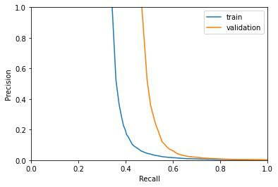

# Task 3

## Description
In this task we used letters from George Washington dated back to the 19th century. Using dynamic time warping (dtw) we try to find similar words in the documents.

## Libraries and Dependencies
`numpy` `matplotlib` `PIL` `cv2` `pandas`
The library `dtaidistance` is used to compute the dtw distances.
Installation instructions can be found [here](https://dtaidistance.readthedocs.io/en/latest/usage/installation.html).  
Juypter Notebook is used to open the ipynb-files. We advise to install [jupyter notebook](https://jupyter.org/).

## Files
In the file *keywords.txt* are all keywords listed that occur at least once in the training and the validation set.  
Files *train.txt* and *valid.txt* contain the documents used for training and validating.  
In the folder *ground-truth* the transcript and the original images are located.  
*preprocessing.py* handles all preprocessing regarding the png files. Feature selection and the rest of calculations are done in *main.ipynb*.

## Preprocessing
Each word in the documents is cropped to a png and normalized to a size of 200x200 pixels. For viewing it is grayscaled, for the feature selection values are set to 0 and 1 for black and white.

## Feature vectors
We used a sliding window approach with a window size of 1px and an offset of 1px. As feature vector we took the number of black pixels per window.

## Results
Weeee we got a plot!  
But our results are.. well..  

#### Final plots

  
The step size of this plot was equal to one.

#### Analysis

Well, as you can see the curves do look somewhat suspect. Both curves do not start at a recall value of zero, but already somewhere around 0.5. Furthermore, in an ideal world, the curves would be convex instead of concave, which would yield a higher average precision (AP) value.  
We do think, that we might have been able to improve this AP value, by adding more features to our feature vector.

## Further information
The file dtw_testing.ipynb is only for testing purposes and library benchmarks.
